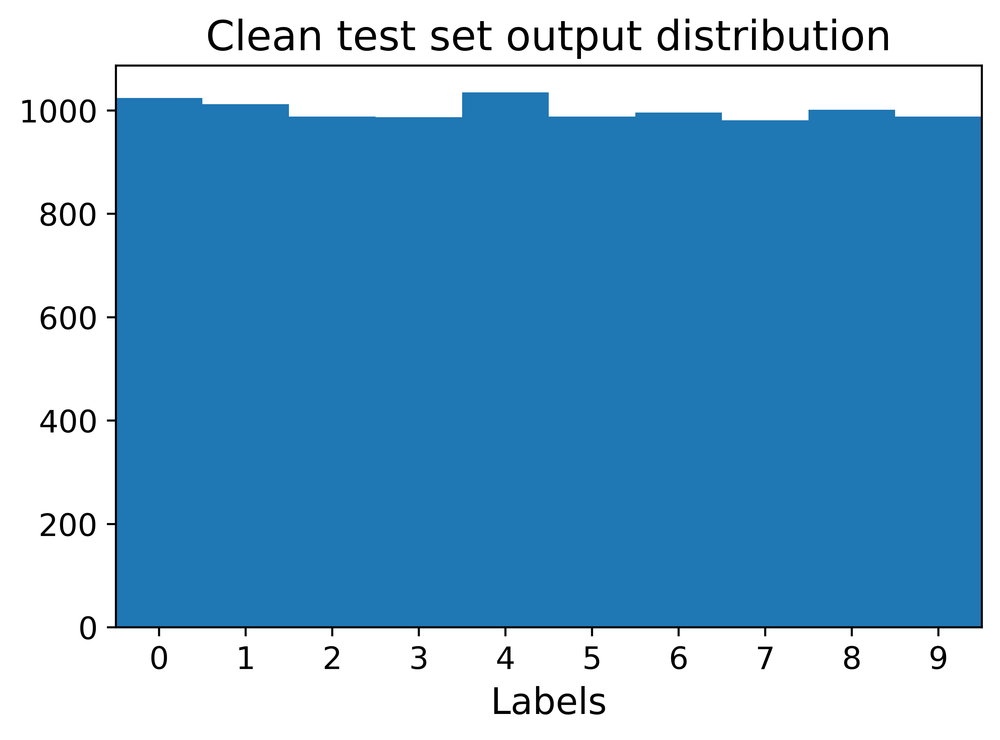

# Universal Adversarial Perturbations via SGD

Universal Adversarial Perturbations (UAPs) generated via [Stochastic Gradient Descent (SGD)](https://ojs.aaai.org//index.php/AAAI/article/view/6017), or sometimes referred to as Stochastic Projected Gradient Descent (sPGD) in  [Mummadi et al.](https://openaccess.thecvf.com/content_ICCV_2019/papers/Mummadi_Defending_Against_Universal_Perturbations_With_Shared_Adversarial_Training_ICCV_2019_paper.pdf) and [Deng & Karam](https://ieeexplore.ieee.org/document/9191288), has been shown to create more effective UAPs than the originally proposed iterative-DeepFool by [Moosavi-Dezfooli et al.](https://openaccess.thecvf.com/content_cvpr_2017/papers/Moosavi-Dezfooli_Universal_Adversarial_Perturbations_CVPR_2017_paper.pdf) We implement targeted and untargeted versions of the SGD-UAP algorithm.


This repository contains sample code and interactive Jupyter notebooks for the following work:

* ["Universal Adversarial Perturbations to Understand Robustness of Texture vs. Shape-biased Training"](https://arxiv.org/abs/1911.10364)
* ["Robustness and Transferability of Universal Attacks on Compressed Models"](https://openreview.net/forum?id=HJx08NSnnE) [(AAAI'21 Workshop)](http://federated-learning.org/rseml2021/)

We encourage you to explore these Python notebooks to generate and evaluate your own UAPs. We suggest testing the notebooks for the CIFAR-10 UAPs first.

### UAPs for Texture vs. Shape
The notebook **texture-shape.ipynb** visualizes some results discussed in the [paper](https://arxiv.org/abs/1911.10364), exploring the UAPs for texture and shape-biased models. Credit to [Geirhos et al.](https://github.com/rgeirhos/texture-vs-shape) for making available their models trained on Stylized-ImageNet.

### UAP Performance
For undefended models trained on ImageNet, we can expect untargeted UAPs to achieve **above 90% evasion rate** on the ImageNet validation set for L-infinity perturbation values of 10/255. An example of a targeted UAP for a ResNet18 model on CIFAR-10 is shown below with its effect on the model's output distribution.

<p align=center width="100%">

&nbsp;&nbsp;&nbsp;


</p>

Pre-computed targeted and untargeted UAPs are made available in this repository for the ResNet18 model on CIFAR-10 and the ResNet50 models on ImageNet.

## Preparation
Refer to instructions [here](https://github.com/pytorch/examples/tree/master/imagenet) for downloading and preparing the ImageNet dataset. 

A pre-trained ResNet18 for CIFAR-10 is available [here](https://drive.google.com/file/d/1lyFy1hXWC-kv8dM5qMS3_frQtyS-F7xv/view?usp=sharing) that achieves 94.02% accuracy on the test set. Pre-trained ImageNet models are available online via [torchvision](https://pytorch.org/docs/stable/torchvision/models.html).

## Supported Universal Attacks
Universal attacks on **CIFAR-10** and **ImageNet** models are based on:

* Stochastic gradient descent UAP as proposed by [Shahfahi et al.](https://ojs.aaai.org//index.php/AAAI/article/view/6017)
* Layer maximization attack proposed by [Co et al.](https://arxiv.org/abs/1911.10364)

We plan to include future support for other UAPs like [procedural noise](https://dl.acm.org/doi/10.1145/3319535.3345660) and [adversarial patches](https://arxiv.org/abs/1712.09665).


## Acknowledgments


Learn more about the [Resilient Information Systems Security (RISS)](http://rissgroup.org/) group at Imperial College London. Kenneth Co is partially supported by [DataSpartan](http://dataspartan.co.uk/).

If you find this project useful in your research, please consider citing:

```
@article{co2019universal,
  title={Universal Adversarial Perturbations to Understand Robustness of Texture vs. Shape-biased Training},
  author={Co, Kenneth T and Mu{\~n}oz-Gonz{\'a}lez, Luis and Kanthan, Leslie and Glocker, Ben and Lupu, Emil C},
  journal={arXiv preprint arXiv:1911.10364},
  year={2019}
}

@article{matachana2020robustness,
  title={Robustness and Transferability of Universal Attacks on Compressed Models},
  author={Matachana, Alberto G and Co, Kenneth T and Mu{\~n}oz-Gonz{\'a}lez, Luis and Martinez, David and Lupu, Emil C},
  journal={arXiv preprint arXiv:2012.06024},
  year={2020}
}
```
This project is licensed under the MIT License, see the [LICENSE.md](LICENSE.md) file for details.
